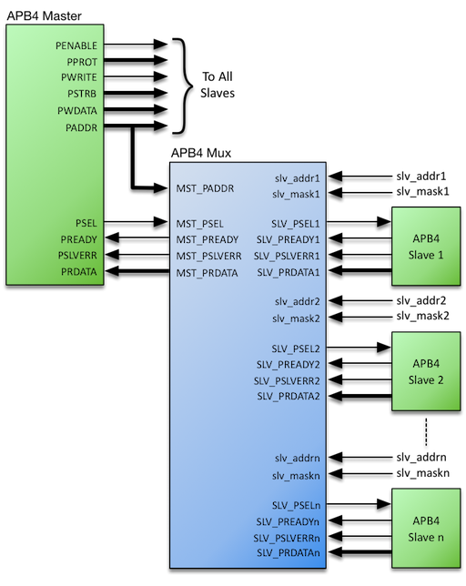

# APB4 Multiplexer Datasheet

## Contents

-   [Introduction](#introduction)
-   [Specifications](#specifications)
-   [Configurations](#configurations)
-   [Interfaces](#interfaces)
-   [References](#references)
-   [Revision History](#revision-history)

## Introduction

The *AMBA APB v2.0* bus protocol - commonly referred to as APB4 - defines a low-cost interface that is optimized for minimal power consumption and reduced interface complexity. To enable a single APB4 Master to communicate with *multiple* APB4 Slaves (Peripherals) via a common bus, certain signals require multiplexing – the Roa Logic APB4 Multiplexer is a fully configurable & parameterized IP to provide this functionality as shown below:

### Features

-   Full support for *APB version 2.0* (APB4) protocol

-   Fully parameterized IP with:

    -   User Configurable number of peripherals supported

    -   User Configurable address and data widths

-   Support for user defined address mapping per peripheral

## Specifications

### Functional Description

The Roa Logic APB4 Multiplexer is a highly configurable, fully parameterized soft IP to enable a single APB4 based Master (Host) to communicate with multiple APB4 Slaves (Peripherals). It is fully compliant with the *AMBA APB v2.0* bus protocols.

The IP contains a single Master Interface to connect to the APB4 Host, and a user defined number of Slave Interfaces.

The multiplexer functions as follows:

-   Transactions on the APB4 Bus are decoded by matching addresses on the APB4 address bus to an address map defined by the `SLV_ADDR[n]` and `SLV_MASK[n]` inputs of the multiplexer

-   Communication with a peripheral is enabled by asserting the appropriate `SLV_PSEL[n]` output signal based on the address mapping (See section 4.3.1)

-   Peripheral-specific control signals `SLV_PSLVERR[n]`and `SLV_READY[n]`, together with the Read Data Bus signals `SLV_PRDATA[n]` during a read transaction, are then multiplexed back to the Master Interface.

### Master Interface

The APB4 Multiplexer Master Interface consists of the following subset of APB4 bus signals:

-   `PADDR` and `PSEL` inputs to enable address space decoding

-   `PREADY` and `PSLVERR` outputs derived from the selected peripheral

-   `PRDATA` read data bus output derived from the selected peripheral during a read transaction

All other APB4 bus signals are connected directly to each peripheral

### Slave Interfaces

The APB4 Multiplexer generates a user-defined number (‘n’) of Slave Interfaces that consist of the following subset of APB4 bus signals:

-   `PSEL[n]` outputs used to select an individual peripheral during a transaction

-   `PREADY[n]` and `PSLVERR[n]` control signal inputs from each peripheral which are multiplexed as outputs on the Master Interface

-   `PRDATA[n]` read data bus inputs from each peripheral which is multiplexed to the Master Interface

### Address Space Configuration

Each Slave Port has an Address Base (`SLV_ADDR[n]`) and Address Mask (`SLV_MASK[n]`) port. Together these set the address range covered by each Slave Port. (See section 4.3.5)

While the Address Base and Address Mask values may be changed dynamically, assigning static values according to a predefined address map is typical.

## Configurations

### Introduction

The Roa Logic APB4 Multiplexer is a fully configurable interconnect IP to enable an APB4 Master to communicate with multiple APB4 slaves (i.e. peripherals). The core parameters and configuration options are described below.

| Parameter    |   Type  | Default | Description                             |
|:-------------|:-------:|:-------:|:----------------------------------------|
| `SLAVES`     | Integer |    8    | Number of attached slaves (peripherals) |
| `PADDR_SIZE` | Integer |    8    | Address Bus Width                       |
| `PDATA_SIZE` | Integer |    8    | Read Data Bus Width                     |

#### SLAVES

The `SLAVES` parameter specifies the number of slaves (i.e. peripherals) the APB4 Multiplexer will support.

#### PADDR\_SIZE

The `PADDR_SIZE` parameter specifies the width of the address bus for the APB4 Interfaces. The Master and all peripherals sharing the APB4 Multiplexer are expected to have the same address width.

#### PDATA\_SIZE

The `PDATA_SIZE` parameter specifies the width of the APB4 data bus. This parameter must equal an integer multiple of bytes. The Master and all peripherals sharing the APB4 Multiplexer are expected to have the same data width.

## Interfaces

### Global Signals

The following common signals are shared between all devices on the APB4 bus.

| Port      | Size | Direction | Description                   |
|:----------|:----:|:---------:|:------------------------------|
| `PRESETn` |   1  |   Input   | Asynchronous active low reset |
| `PCLK`    |   1  |   Input   | Clock Input                   |

#### PRESETn

When the active low asynchronous `PRESETn` input is asserted (‘0’), the APB4 interface is put into its initial reset state.

#### PCLK

`PCLK` is the APB4 interface system clock. All internal logic for the APB4 interface operates at the rising edge of this system clock and APB4 bus timings are related to the rising edge of `PCLK`.

### Master Interface

The APB4 Interface decodes the signaling of an APB4 bus master and therefore implements a subset of a regular APB4 Slave Interface.

| Port          |     Size     | Direction | Description              |
|:--------------|:------------:|:---------:|:-------------------------|
| `MST_PSEL`    |       1      |   Input   | Peripheral Select        |
| `MST_PADDR`   | `PADDR_SIZE` |   Input   | Address Bus              |
| `MST_PRDATA`  | `PDATA_SIZE` |   Output  | Read Data Bus            |
| `MST_PREADY`  |       1      |   Output  | Transfer Ready           |
| `MST_PSLVERR` |       1      |   Output  | Transfer Error Indicator |

#### MST\_PSEL

it is selected and a data transfer is pending. This signal drives the APB4 Multiplexer MST\_PSEL port and is decoded to select the individual peripheral by asserting the corresponding `SLV_PSEL[n]` output..

#### MST\_PADDR

`MST_PADDR` is the APB4 address bus. The bus width is defined by the `PADDR_SIZE` parameter and is driven by the APB4 Master.

#### MST\_PRDATA

`MST_PRDATA` drives the APB4 read data bus. The selected peripheral drives this bus during read cycles, via the APB4 Multiplexer.

The bus width must be byte-aligned and is defined by the `PDATA_SIZE` parameter.

#### MST\_PREADY

`MST_PREADY` is driven by the selected peripheral via the APB4 Multiplexer. It is used to extend an APB4 transfer.

#### MST\_PSLVERR

`MST_PSLVERR` indicates a failed data transfer to the APB4 Master when asserted (‘1’) and is driven by the selected peripheral via the APB4 Multiplexer.

### Slave Interface

The Slave Interface provides the following signals *for each* individual peripheral. The number of peripherals supported, and therefore instances of the following signals, is controlled by the SLAVES parameter (see section 0).

> **Note:** Each individual port name is referenced by the index ‘n’, where ‘n’ is an integer value in the range 0 to `SLAVES-1`. E.g. `SLV_PSEL[2]` This nomenclature is used throughout this datasheet

| Port             |     Size     | Direction | Description              |
|:-----------------|:------------:|:---------:|:-------------------------|
| `SLV_PSEL[n]`    |       1      |   Output  | Peripheral Select        |
| `SLV_PRDATA[n]`  | `PDATA_SIZE` |   Input   | Read Data Bus            |
| `SLV_PREADY[n]`  |       1      |   Input   | Transfer Ready Input     |
| `SLV_PSLVERR[n]` |       1      |   Input   | Transfer Error Indicator |
| `SLV_ADDR[n]`    | `PADDR_SIZE` |   Input   | Transfer Ready Input     |
| `SLV_MASK[n]`    | `PADDR_SIZE` |   Input   | Transfer Error Indicator |

#### SLV\_PSEL\[n\]

The APB4 Multiplexer generates `SLV_PSEL[n]`, signaling to an attached peripheral that it is selected and a data transfer is pending.

#### SLV\_PRDATA\[n\]

`SLV_PRDATA[n]` is the APB4 read data bus associated with the attached peripheral. The peripheral drives this bus during read cycles, indicated when `PWRITE` is negated (‘0’), and the data is then multiplexed to the `MST_PRDATA` output port.

The bus width must be byte-aligned and is defined by the `PDATA_SIZE` parameter.

#### SLV\_PREADY\[n\]

`SLV_PREADY[n]` is driven by the attached peripheral and multiplexed to the `MST_PREADY `output port. It is used to extend an APB4 transfer.

#### SLV\_PSLVERR\[n\]

`SLV_PSLVERR[n]` indicates a failed data transfer when asserted (‘1’). As APB4 peripherals are not required to support this signal it must be tied LOW (‘0’) when unused.

#### SLV\_ADDR\[n\] and SLV\_MASK\[n\]

`SLV_ADDR[n]` is the base address where the attached peripheral is to appear in the system memory map. It is bitwise ‘AND’ed with the corresponding address mask `SLV_MASK[n]` input to define the overall address range of each peripheral.

As a consequence, these ports are typically assigned hard-coded values rather than connected to other logic in the design.

## References

## Revision History

| Date        | Rev. | Comments        |
|:------------|:----:|:----------------|
| 13-Oct-2017 |  1.0 | Initial Release |
|             |      |                 |
|             |      |                 |
|             |      |                 |
