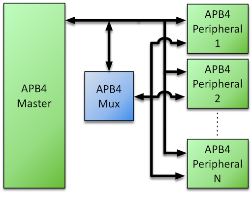

# APB4 Multiplexer
The [AMBA APB v2.0 bus protocol](http://infocenter.arm.com/help/topic/com.arm.doc.ihi0024c/index.html) – commonly referred to as APB4 – defines a low-cost interface that 
is optimized for minimal power consumption and reduced interface complexity. To enable a single APB4 Master to communicate with *multiple* APB4 Slaves (Peripherals) via a common bus, certain signals require 
multiplexing – the Roa Logic APB4 Multiplexer is a fully configurable & parameterized IP to provide this functionality.

## Documentation

- [Datasheet](DATASHEET)
  - [PDF Format](docs/APB4-Multiplexer-Datasheet.pdf)

## Features

- Full support for [APB version 2.0 (APB4) protocol ](http://infocenter.arm.com/help/topic/com.arm.doc.ihi0024c/index.html)
- Fully parameterized IP with:
  - User Configurable number of peripherals supported
  - User Configurable address and data widths
- Support for user defined address mapping per peripheral

## Compatibility

Compatible with  [APB version 2.0 (APB4) protocol ](http://infocenter.arm.com/help/topic/com.arm.doc.ihi0024c/index.html) 

## Interfaces

- APB4

## License

Released under the RoaLogic [Non-Commercial License](/LICENSE.md)

## Dependencies
Requires the Roa Logic [AHB3Lite Package](). This is are included as a submodule.
After cloning the repository, perform a 'git submodule init' to download the submodule.